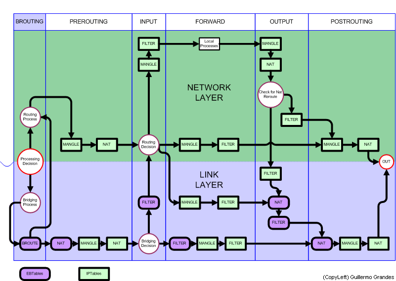

# Networking

The following represent useful Linux commands when it comes to networking. This is a list of examples that can be adapted to your personal needs.

## IP & routing

We will mostly use the `iproute2` package (the `ip` command).

### Add / delete IP address

To configure the IP `192.168.0.1/24` on interface `veth-red`, we can run:

```bash
# Long version
ip address add 192.168.0.1/24 dev veth-red

# Short version
ip a a 192.168.0.1/24 dev veth-red
```

To confirm the changes, we can run:

```bash
# Long version
ip address show dev veth-red

# Short version
ip a sh veth-red
```

To remove this IP address, it is enough to run:

```bash
# Long version
ip address delete 192.168.0.1/24 dev veth-red

# Short version
ip a d 192.168.0.1/24 dev veth-red
```

You could completely flush the interface instead:

```bash
# Long version
ip address flush dev veth-red

# Short version
ip a f veth-red
```

If you wanted to use IPv6 instead of IPv4, you can run `ip -6` instead of `ip` (`ip -4`).

### Datalink config

To check out the current datalink config of a given interface, you can run:

```bash
# Long version
ip link show dev veth-red

# Short version
ip l sh veth-red
```

Let's now set **up** or **down** this interface:

```bash
# Long version
ip link set dev veth-red up

# Short version
ip l s veth-red up
```

### Routing

To enable routing, we need to run: `sysctl -w net.ipv4.ip_forward=1` (or `sysctl -w net.ipv6.conf.all.forwarding=1` for IPv6 routing).

To set a default gateway, it is as simple as:

```bash
# Long version
ip route add default via 10.10.10.1

# Short version
ip r a default via 10.10.10.1
```

We can check the current configuration using:

```bash
# Long version
ip route show

# Short version
ip r sh
```

### ARP table

We can check out the ARP table using:

```bash
# Long version
ip neighbor show

# Short version
ip n sh
```

One way to fill this table could be running the `ping` command.

### TCP dump

To inspect a given interface, say `veth-red`, we could run `tcpdump -n -i veth-red`.


## iptables

A good article to learn more about `iptables` can be found [here](https://phoenixnap.com/kb/iptables-tutorial-linux-firewall).



To output the current iptables config, we could use:

```bash
iptables -n -v --line-numbers -L [chain]
```

Generally, commands tend to follow this pattern:

```bash
iptables [option] CHAIN_rule [-j target]
```

Here is a list of some common iptables options:

- `-A` (`--append`) – Add a rule to a chain (at the end).
- `-C` (`--check`) – Look for a rule that matches the chain’s requirements.
- `-D` (`--delete`) – Remove specified rules from a chain.
- `-F [chain]` (`--flush`) – Remove all rules.
- `-I chain [rulenum]` (`--insert`) – Add a rule to a chain at a given position.
- `-L` (`--list`) – Show all rules in a chain.
- `-N` (`--new`) – Create a new chain.
- `-v` (`--verbose`) – Show more information when using a list option.
- `-X` (`--delete-chain`) – Delete the provided chain.

By default, the `filter` table will be affected. However, if this is not intended, you can choose another filter using the `-t` (`--table`) option.

The `-j` (`--jump`) option will specify the target for the current rule.

For example, `iptables -A INPUT -i lo -j ACCEPT` will append to the INPUT chain a rule that allows any traffic on the loopback interface.

Here is a list with other common iptables options:

- `-d` (`--destination`) - Specifies the destination.
- `-s` (`--source`) - Specifies the source.
- `-p` (`--proto`) - Specifies the protocol (e.g. `tcp`).
- `--dport` - Specifies the port, based on `/etc/services`.

### Statefulness

What if you want to only allow the TCP traffic that a certain machine has initiated? This would be impossible without the `state` module implemented in `iptables`.

In order to use the _statefulness_ of `iptables`, you have to first load the module using the `-m` parameter and then specify a state using `--state`. [For example](https://explainshell.com/explain?cmd=iptables+-A+INPUT+-m+state+--state+ESTABLISHED%2CRELATED+-j+ACCEPT):

```bash
iptables -A INPUT -m state --state ESTABLISHED,RELATED -j ACCEPT
```

Read more about this feature [here](https://kb.novaordis.com/index.php/Iptables_State_Module).